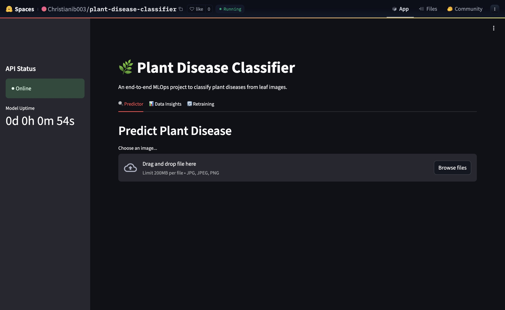
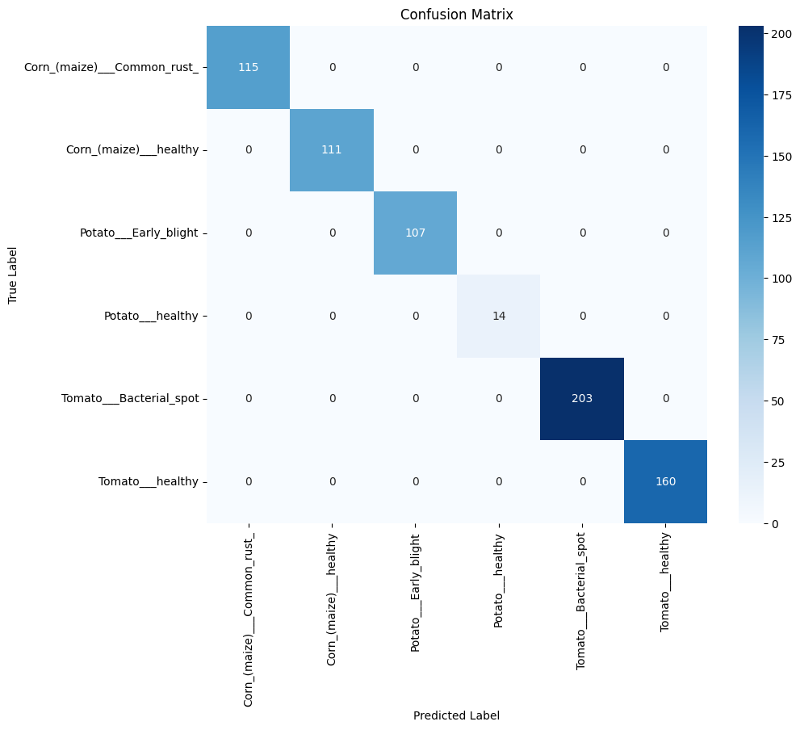
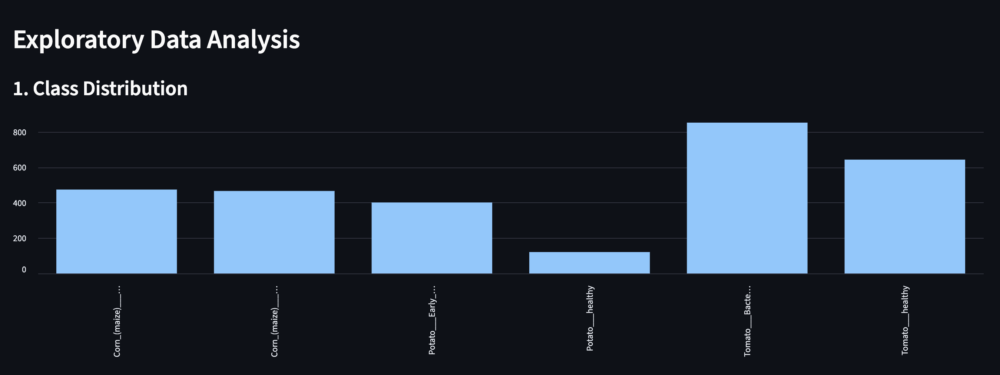
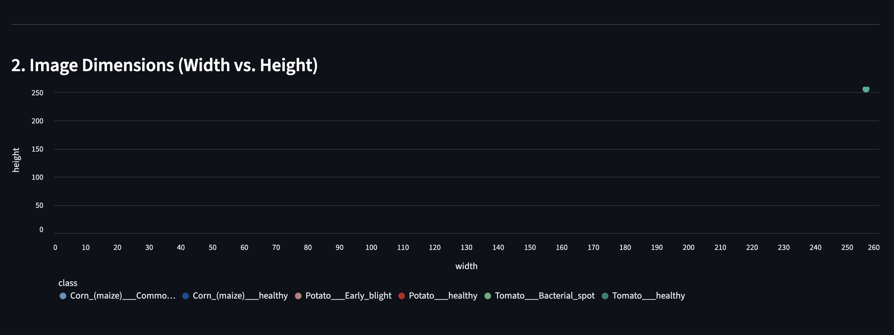
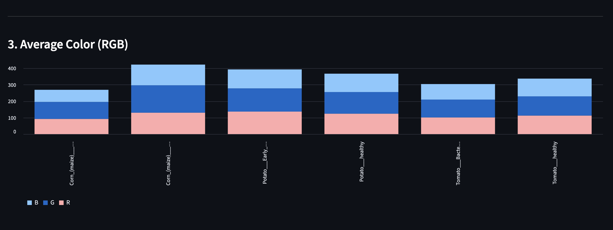
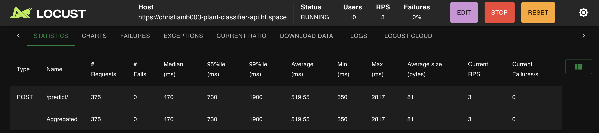
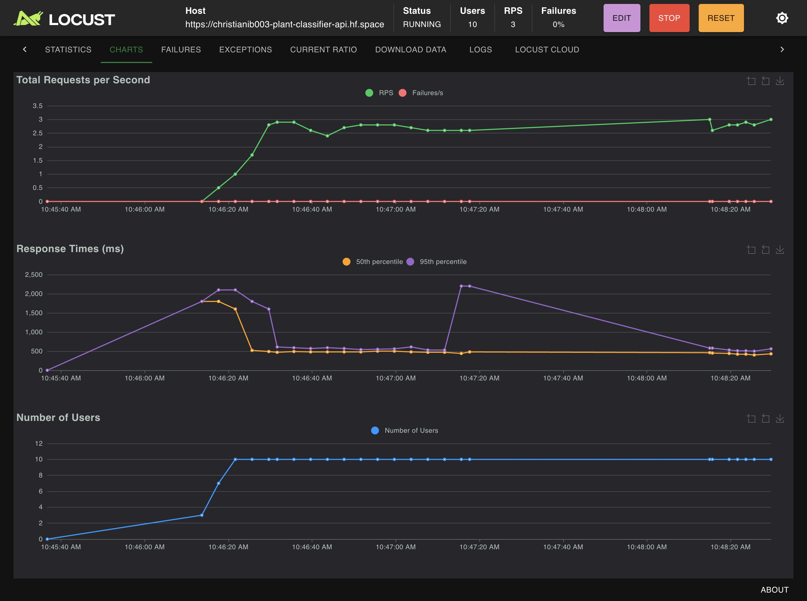

# 🌿 End-to-End Plant Disease Classification Pipeline

## 1. Project Overview
This project demonstrates a full end-to-end Machine Learning Operations (MLOps) pipeline designed to address the task of plant disease classification from leaf images. The primary objective is to build, deploy, and monitor a robust deep learning model capable of identifying various diseases across different plant species, leveraging a subset of the PlantVillage dataset.

The solution encompasses the entire machine learning lifecycle, starting from initial data acquisition and exploratory analysis, through model development using transfer learning, and culminating in a containerized deployment. The final product is an interactive web application that allows users to get real-time predictions, view data insights, and trigger model retraining cycles, showcasing a complete and practical application of MLOps principles.




## 2. Live Application & Demo
* **Live Application URL:** https://huggingface.co/spaces/Christianib003/plant-disease-classifier
* **API Application URL:** https://christianib003-plant-classifier-api.hf.space/docs
* **Public Docker Image:** https://hub.docker.com/r/christianib003/plant-disease-classification

* **Video Demo::** A YouTube link to a video demonstration will be added here once recorded.]


## 3. Getting Started

### 3.1. Folder Structure

The project is organized into a clean, modular structure to separate concerns:

```
plant-disease-classifier/
├── app/                # Contains all runnable application code (API & UI)
├── src/                # Python package with core logic (model, preprocessing, utils)
├── data/               # Raw image dataset (train/val splits)
├── models/             # Saved model artifacts (.keras files)
├── notebooks/          # Jupyter notebooks for experimentation
├── Dockerfile          # Instructions to build the application container
├── requirements.txt    # Project dependencies
└── README.md           # Project documentation
```

### 3.2. Local Setup Instructions

**Prerequisites:**

  * Python 3.9+
  * Docker Desktop
  * Git

**Steps:**

1.  **Clone the repository:**
    ```bash
    git clone https://github.com/Christianib003/mlops.git
    cd mlops
    ```
2.  **Create and activate a virtual environment:**
    ```bash
    python -m venv venv
    source venv/bin/activate
    # On Windows, use: venv\Scripts\activate
    ```
3.  **Install dependencies:**
    ```bash
    pip install -r requirements.txt
    ```
4.  **Run the application using Docker (Recommended):**
    ```bash
    # Build the Docker image
    docker build -t plant-disease-app .

    # Run the container, mapping the required ports
    docker run -p 8000:8000 -p 8501:8501 plant-disease-app
    ```
      * Access the UI at: `http://localhost:8501`
      * Access the API docs at: `http://localhost:8000/docs`


## 4. Machine Learning Pipeline Implementation
This section provides a detailed breakdown of the offline processes involved in creating the machine learning model. Each stage, from data acquisition to API creation, was designed to follow MLOps best practices for reproducibility, efficiency, and robustness.

### 4.1. Data Acquisition
The foundation of this project is the PlantVillage dataset, a public repository containing tens of thousands of images of healthy and diseased plant leaves.

- **Dataset Selection:** To create a focused and manageable project scope suitable for rapid development and deployment, a subset of the full dataset was selected. This subset comprises **6 distinct classes**, representing healthy and diseased leaves from three different plants: Corn (Maize), Potato, and Tomato.

- **Initial Structure:** The chosen data was pre-organized into `train` and `val` directories, providing a standard starting point for most machine learning classification tasks.

### 4.2. Data Processing
A high-performance data processing pipeline was constructed using TensorFlow's tf.data API to efficiently handle image loading and transformations. This approach is optimized for performance, minimizing I/O bottlenecks during training.

- **Data Splitting Strategy:** While a `train`/`val` split was provided, a more rigorous evaluation strategy was implemented. The initial `val` set was further split 50/50 to create two distinct, non-overlapping datasets:

    1. **A Validation Set**, used exclusively during the training loop to monitor the model's performance on unseen data and trigger callbacks like Early Stopping.

    2. A final **Test Set**, which was held out and used only once after all training was complete. This provides a truly unbiased assessment of the model's generalization capabilities.

- **Image Transformation Pipeline:**

    - **Resizing:** All images, regardless of their original dimensions, were resized to a uniform **224x224 pixels**. This step is mandatory as it ensures the input data conforms to the fixed input size expected by the pre-trained MobileNetV2 architecture.

    - **Data Augmentation:** To build a more robust model and mitigate overfitting, a series of random transformations were applied only to the training set on-the-fly. These included `RandomFlip` (horizontal and vertical), `RandomRotation`, and `RandomZoom`. This technique artificially expands the training dataset, teaching the model to be invariant to changes in orientation and scale.

    - **Normalization:** A model-specific normalization was applied, scaling pixel values to the [-1, 1] range as required by the `tf.keras.applications.mobilenet_v2.preprocess_input` function. This ensures that the input data distribution matches what the model saw during its original training on ImageNet.

### 4.3. Model Creation
A **Transfer Learning** strategy was chosen over training a model from scratch. This approach leverages the knowledge of a model pre-trained on a massive dataset (ImageNet), which is highly effective for computer vision tasks, especially with a limited dataset.

- **Base Model Architecture: MobileNetV2** was selected as the base model. This choice was deliberate, prioritizing a balance of high accuracy with computational efficiency. Its lightweight architecture results in faster training, lower prediction latency, and a smaller final model size, making it ideal for deployment. The weights of the base model were "frozen" during the initial training phase, allowing it to act as a powerful, fixed feature extractor.

- **Custom Classification Head:** A new classification head was built and attached to the frozen base model. It consists of:

    - `GlobalAveragePooling2D`: To flatten the feature maps from the base model into a single feature vector per image.

    - `Dropout(0.2)`: A regularization layer that randomly deactivates 20% of neurons during training to prevent co-adaptation and reduce overfitting.

    - `Dense(6, activation='softmax')`: The final output layer with 6 neurons (one for each class) and a softmax activation function to produce a probability distribution over the classes.

- **Optimization & Compilation:**

    - **Optimizer:** The model was compiled with the `Adam` optimizer, a robust and widely used algorithm that adapts the learning rate during training.

    - **Loss Function:** `categorical_crossentropy` was used, as it is the standard loss function for multi-class classification problems with one-hot encoded labels.

    - **Early Stopping:** To ensure the model did not overfit and to find the optimal number of training epochs automatically, an `EarlyStopping` callback was implemented. It monitored the `val_loss` and halted training when the validation loss stopped improving, restoring the model weights from the best-performing epoch.

### 4.4. Model Testing
After the training process was completed, the final model was evaluated on the held-out test set. The results demonstrated outstanding performance.

- **Performance Metrics:**

  - **Test Accuracy:** 100.00%

  - **Test Precision:** 100.00%

  - **Test Recall:** 100.00%

- **Confusion Matrix:**


    - **Interpretation:** The confusion matrix is perfect, with all predictions lying on the main diagonal. This indicates that the model made zero classification errors on the test set, correctly identifying every image from all six classes. The combination of transfer learning and data augmentation proved highly effective for this task.

### 4.5. Model Retraining Implementation
The system was designed with two distinct training functionalities, exposed via API endpoints, to simulate a real-world MLOps environment.

- **Train Endpoint (`/train`):** This function serves as a "factory reset" or baseline generator. It triggers a full training cycle from scratch on the original dataset, building and saving the primary production model (`plant_classifier_v1.keras`). This is crucial for reproducibility and for resetting the model after experimental retraining cycles.

- **Retrain Endpoint (`/retrain`):** This function enables continuous improvement of the model. It is designed to accept new, user-uploaded images. The endpoint loads the existing baseline model and fine-tunes it only on the new data provided. To ensure safety and enable versioning, the newly fine-tuned model is saved as a separate artifact, preserving the original production model.

### 4.6. API Creation
A RESTful API was developed using **FastAPI** to serve as the backend for the application. FastAPI was chosen for its high performance, asynchronous capabilities, and automatic generation of interactive API documentation. The API exposes the core machine learning logic through well-defined endpoints, decoupling the model from the user interface.


## 5. User Interface (UI)
An interactive and user-friendly web interface was developed using **Streamlit** to provide a front-end for the machine learning model. Streamlit was chosen for its ability to rapidly create data-centric applications directly from Python scripts. The UI is organized into a clean, tabbed layout to separate the main functionalities: Prediction, Data Insights, and Retraining.

### 5.1. Data Visualizations
To fulfill the requirement of creating meaningful interpretations of the dataset, an "Data Insights" tab was created. This section presents three key visualizations that tell a story about the dataset's characteristics.

1. **Class Distribution**


- **Interpretation:** This bar chart visualizes the number of images available for each of the six classes in the training set. It immediately reveals a significant class imbalance.

- **Story:** The `Tomato___Bacterial_spot` and `Tomato___healthy` classes are the majority, while the `Potato___healthy` class is severely underrepresented. This imbalance is a critical insight, as it warns that a model trained on this data could become biased. It justifies the decision to focus on per-class evaluation metrics like precision, recall, and the confusion matrix, as overall accuracy could be a misleading indicator of the model's true performance.

2. **Image Dimensions (Width vs. Height)**

- **Interpretation:** This scatter plot displays the width versus the height of a sample of images from the dataset.

- **Story:** The plot shows that the source images are not uniform in size, with most clustering around the `256x256 pixel` mark but with significant variation. This observation makes it clear that a mandatory resizing step is required in the preprocessing pipeline. By resizing all images to a consistent 224x224 pixels, we ensure that the data conforms to the fixed input size of the `MobileNetV2` model, which is essential for the model to function correctly.

3. **Average Color per Class (RGB)**


- **Interpretation:** This chart shows the average Red, Green, and Blue (RGB) color values calculated from a sample of images for each class.

- **Story:** The visualization reveals distinct color profiles for different classes. For instance, healthy classes like `Corn___healthy` and `Tomato___healthy` exhibit a dominant green channel. In contrast, diseased classes such as `Corn___Common_rust_` and `Potato___Early_blight` show a reduced green component and a relative increase in red and brown tones. This tells a powerful story: color is a strong predictive feature. It confirms that the convolutional neural network can leverage these color differences to effectively distinguish between healthy and diseased leaves.

### 5.2. User Interaction Functionalities
The UI is designed to be intuitive, allowing users to easily access all core features of the MLOps pipeline.

- **Prediction:** In the "Predictor" tab, a user can upload a single image (`.jpg`, `.jpeg`, `.png`) of a plant leaf. Upon clicking the "Predict" button, the UI sends the image to the backend API and displays the predicted class and the model's confidence score in real-time.

- **Training & Retraining:** The "Retraining" tab provides access to the model's learning capabilities.

    - **File Upload for Retraining:** A multi-file uploader allows the user to select several new images for retraining. To ensure proper labeling, the user is instructed to name each file starting with the correct class name (e.g., `Tomato___healthy_new_leaf.jpg`).

    - **Trigger Retraining:** A "Start Retraining" button triggers a POST request to the `/retrain` API endpoint, sending the new images to the backend. The UI displays a spinner to indicate that the process is running and shows a success message upon completion.

## 6. Deployment and Performance
This section details the process of packaging the application for deployment and analyzes its performance under simulated user load.

### 6.1. Cloud Deployment
To ensure the application is portable, reproducible, and isolated from the underlying infrastructure, it was containerized using **Docker**.

- **Containerization:** A `Dockerfile` was created to define the application environment. It starts from a lightweight Python base image, installs all necessary dependencies from `requirements.txt`, copies the entire project source code, and exposes the necessary ports for the API (`8000`) and the UI (`7860`). A `start.sh` script is used as the entry point to launch both the FastAPI backend and the Streamlit frontend concurrently within the container.

- **Continuous Integration/Deployment (CI/CD):** A CI/CD pipeline was established using GitHub Actions. This workflow automatically triggers on any push to the `dev` branch. It builds the Docker image and pushes it to a public **Docker Hub** repository, ensuring that a new, deployable artifact is always available.

- **Deployment Platform:** The containerized application was deployed on **Hugging Face** Spaces. The Space was configured to pull the latest image directly from the public Docker Hub repository. This platform was chosen for its seamless integration with Docker, its generous free tier for hosting ML applications, and its simplicity for public deployment.

### 6.2. Performance Simulation (Load Testing)

To evaluate how the deployed API performs under pressure, a load test was conducted using **Locust**. The test simulated 10 concurrent users sending prediction requests to the deployed API endpoint.




**Test Parameters:**
* **Number of Users:** 10
* **Spawn Rate:** 3 users per second
* **Host:** Deployed API on Hugging Face Spaces

**Analysis of Results:**
The load test was successful, with **0% failures** over the duration of the test, indicating that the application is stable under the simulated load.

* **Throughput:** The application stabilized at a throughput of approximately **3 Requests Per Second (RPS)**. This is a solid performance for a deep learning model running on the free-tier CPU hardware provided by the deployment platform.
* **Response Time:** The median response time was consistently below **500ms**, and the 95th percentile response time (meaning 95% of requests were faster than this value) stabilized at around **730ms**. This demonstrates that the API is highly responsive for individual users.
* **Scalability:** The current performance is limited by the resources of a single container. In a production environment, this application could be scaled horizontally by increasing the number of container instances. This would significantly increase the total RPS the system could handle, allowing it to serve a much larger number of concurrent users.
